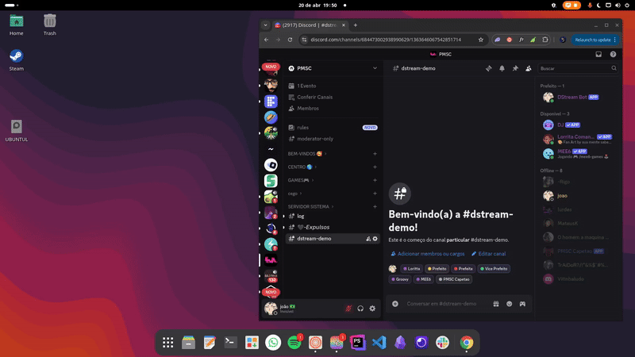

# DStream Bot - Discord Chat Widget for OBS

A lightweight Discord bot that functions as a chat widget for OBS, displaying messages in your stream overlay with clean animations.



## Features

-   **Simple commands**: `/start` to begin monitoring, `/stop` to pause
-   **Beautiful chat display**: Clean animations and customizable appearance
-   **OBS-ready**: Easy to add as a browser source
-   **Lightweight**: Built with Bun for fast performance
-   **Extensible**: Contributions welcome for Node.js compatibility

## Quick Start

### Prerequisites

-   [Bun](https://bun.sh/) installed
-   Discord developer account
-   Access to a Discord server

### Installation

1. **Clone the repository**

    ```bash
    git clone https://github.com/yourusername/dstream-bot.git
    cd dstream-bot
    ```

2. **Install dependencies**

    ```bash
    bun install
    ```

3. **Set up environment variables**

    - Copy `.env.example` to `.env` in the `/bot` directory
    - Fill in your Discord credentials:
        ```env
        PUBLIC_KEY=your_public_key
        APPLICATION_ID=your_app_id
        SECRET_KEY=your_secret_key
        SECRET_TOKEN=your_bot_token
        SERVER_ID=your_server_id
        # Optional: Change default port if needed
        SOCKET_PORT=8000
        ```

4. **Run the bot in development mode**

    ```bash
    bun dev
    ```

5. **Run the bot**

    ```bash
    bun start
    ```

6. **Set up OBS**
    - Add a Browser Source in OBS
    - URL: `http://localhost:5173` (or your custom frontend URL)
    - Width: 400px (recommended)
    - Height: 600px (recommended)

## Bot Commands

| Command  | Description                           |
| -------- | ------------------------------------- |
| `/start` | Begins monitoring the current channel |
| `/stop`  | Stops monitoring the current channel  |

## Frontend Configuration

The frontend runs on `http://localhost:5173` by default. You can configure:

-   **WebSocket port**: Must match your bot's `SOCKET_PORT` (default: 8000)
-   **Appearance**: Customize colors and layout via CSS variables

## Development

### Running in development mode

```bash
bun run dev
```

### Building for production

```bash
bun run build
```

## Contributing

We welcome contributions! While the primary runtime is Bun, we're open to:

-   Node.js compatibility patches
-   New features
-   UI improvements
-   Bug fixes

Please open an issue to discuss your proposed changes before submitting a PR.

## Important Notes

1. **Order matters**: The bot must be running before starting the frontend
2. **Permissions**: Your bot needs:
    - `View Channels` permission
    - `Read Message History` permission
    - `Send Messages` permission
3. **Security**: Never commit your `.env` file!

## License

MIT License - See [LICENSE](LICENSE) for more information.

---

Enjoy streaming with DStream Bot! For support, please open an issue in the repository.
